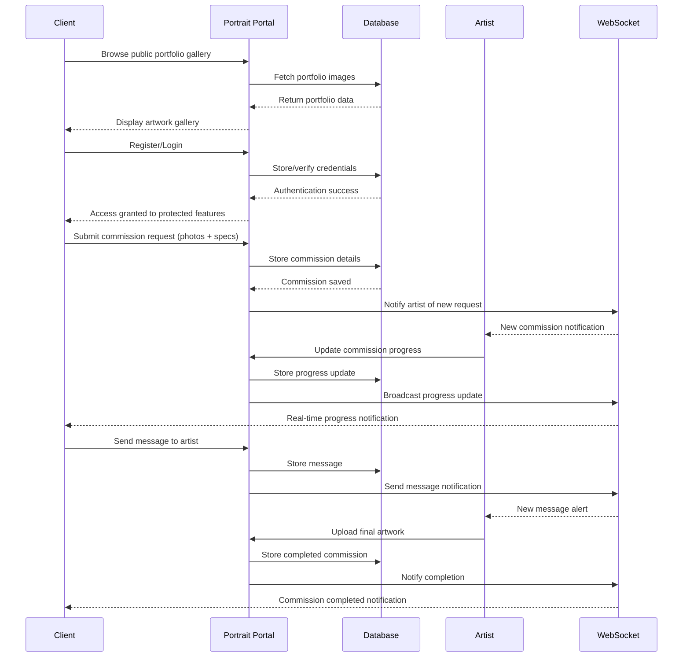

# Portrait Portal

[My Notes](notes.md)

Portrait Portal is a web-based commission management platform that connects clients with custom portrait services. The application features a public portfolio gallery, secure user authentication, commission request forms with file upload capabilities, real-time progress tracking, and client dashboard functionality. Built as a single-page application using React, it integrates backend services for data management and WebSocket connections for live updates.

> [!NOTE]
>  This is a template for your startup application. You must modify this `README.md` file for each phase of your development. You only need to fill in the section for each deliverable when that deliverable is submitted in Canvas. Without completing the section for a deliverable, the TA will not know what to look for when grading your submission. Feel free to add additional information to each deliverable description, but make sure you at least have the list of rubric items and a description of what you did for each item.

> [!NOTE]
>  If you are not familiar with Markdown then you should review the [documentation](https://docs.github.com/en/get-started/writing-on-github/getting-started-with-writing-and-formatting-on-github/basic-writing-and-formatting-syntax) before continuing.

## 🚀 Specification Deliverable

> [!NOTE]
>  Fill in this sections as the submission artifact for this deliverable. You can refer to this [example](https://github.com/webprogramming260/startup-example/blob/main/README.md) for inspiration.

For this deliverable I did the following. I checked the box `[x]` and added a description for things I completed.

- [x] Proper use of Markdown
- [x] A concise and compelling elevator pitch
- [x] Description of key features
- [x] Description of how you will use each technology
- [x] One or more rough sketches of your application. Images must be embedded in this file using Markdown image references.

### Elevator pitch

Step through the Portrait Portal, where memories become magic. They say a picture is worth a thousand words, but what if that picture could transport you back to your most precious moments? Portrait Portal opens a gateway to transform fleeting moments into timeless art. Whether it's capturing your partner's radiant smile, honoring your late grandparent's legacy, or freezing a moment of pure joy before time changes everything, I transform these precious memories into portals that let you revisit them forever. No more endless searching for the right artist or worrying about miscommunication! Simply upload your photos, share your vision, and watch as your memories are reborn as beautiful, hand-crafted portraits. With real-time progress updates and direct communication throughout the creative journey, commissioning custom and cherished art has never been more seamless or magical.

### Design

The application features a gallery-style interface where potential clients can browse the portfolio without registration. Once interested, clients create accounts to submit commission requests with detailed specifications and reference photos. The platform provides real-time progress tracking and direct communication throughout the creative process.

### Key features

- Public portfolio gallery showcasing completed artwork and different artistic styles (accessible without login)
- Secure user authentication system for commission management and tracking
- Commission request form with photo upload and detailed specification options (login required)
- Real-time progress tracking with status updates via WebSocket
- Client dashboard for managing commission history and ongoing projects
- Direct messaging system for client-artist communication throughout the creative process

### Technologies

I am going to use the required technologies in the following ways.

- **HTML** - Uses correct HTML structure for application. Multiple pages with hyperlinks to navigate between sections, including: 
    - Public page: Portfolio gallery, about page
    - Login page: Authentication
    - Protected pages: Commission request form, client dashboard
- **CSS** - Application styling that is visually appealing across different devices. Implements artistic yet minimalistic design that utilizes principles of adequate whitespace, pleasing color choice, and visual simplicity while still maintaining individuality. Gallery-style grid layout for portfolio display.
- **React** - Provides portfolio browsing, login, commission submission, progress tracking, messaging, and backend endpoint calls. Single page application with component views that is reactive to user actions.
- **Service** - Backend service with endpoints for managing commissions, file uploads, and progress updates. Includes user authentication (login/logout/register), commission management, and integration with a third-party color palette API to help clients visualize potential color schemes for their custom portraits.
- **DB/Login** - Store client authentication, commission details, and project history in database. Secure login required for commission management.
- **WebSocket** - Real-time updates when commission status changes and new messages are received.

## 🚀 AWS deliverable

For this deliverable I did the following. I checked the box `[x]` and added a description for things I completed.

- [x] **Server deployed and accessible with custom domain name** - [My server link](https://startup.portraitportal.me).

Copied CS 260 API and created my own instance using that template. Got my server up on an IP address, then redirected traffic under my domain name to that IP address (98.89.159.49). I then updated the Caddy file to be able to access securely through https:// rather than just http://.

## 🚀 HTML deliverable

For this deliverable I did the following. I checked the box `[x]` and added a description for things I completed.

- [x] **HTML pages** - Created home page (index), public pages (about, gallery), login (login), and private pages requiring user authentication (commission, dashboard).
- [x] **Proper HTML element usage** - I found myself lost at the nested nature of the elements at times, but having the instant feedback of the live server extension helped me fix errors more quickly.
- [x] **Links** - Links to navigate between pages as well as to different sections of the gallery on the same page.
- [x] **Text** - Included text to give content to HTML structure, resolved using some initial usability testing with friends to see what felt the smoothest/most natural.
- [x] **3rd party API placeholder** - Included placeholder in commission.html for color palette selection.
- [x] **Images** - Included in gallery.html with placeholders as well as in the gallery preview on index.html.
- [x] **Login placeholder** - See login.html.
- [x] **DB data placeholder** - See commission descriptions on dashboard.html acquired via commission.html.
- [x] **WebSocket placeholder** - See messaging logs on dashboard.html.

## 🚀 CSS deliverable

For this deliverable I did the following. I checked the box `[x]` and added a description for things I completed.

- [x] **Header, footer, and main content body** - Completed for each page, had trouble with remembering to include Bootstrap to keep it consistent across them but eventually got it.
- [x] **Navigation elements** - Added opacity to animate when hover action happens, and also created a navbar for the top next to title.
- [x] **Responsive to window resizing** - I thought of different ways to stack things for desktop vs mobile and made conditional cases for mobile.
- [x] **Application elements** - Handled buttons, checkboxes, form submissions.
- [x] **Application text content** - Formatted all the different levels of text.
- [x] **Application images** - Seen in gallery preview on home page as well as on gallery page.

## 🚀 React part 1: Routing deliverable

For this deliverable I did the following. I checked the box `[x]` and added a description for things I completed.

- [x] **Bundled using Vite** - Project is bootstrapped with Vite; `npm run dev` starts the dev server and `npm run build` produces a production bundle.
- [x] **Components** - Implemented React components and views as named exports: `Home`, `Login`, `Gallery`, `Commission`, and `Dashboard` (located under `src/*`). Components are imported into `src/app.jsx`.
- [x] **Router** - React Router v6 configured in `src/app.jsx` using `BrowserRouter`, `Routes`, `Route`, and `NavLink`. Client-side navigation works; a `NotFound` route is included for unknown paths.

## 🚀 React part 2: Reactivity deliverable

For this deliverable I did the following. I checked the box `[x]` and added a description for things I completed.

- [x] **All functionality implemented or mocked out** - Mocked backend pieces using localStorage (user/auth, commissions, messages, file metadata). Commission submission saves to storage and starts a client-side simulateProgress (setTimeouts) that updates commission.progress and dispatches 'commissions:updated' events to emulate WebSocket pushes so the app behaves fully functional for the demo.
- [x] **Hooks** - Used React hooks across components: useState for local/form/draft state, useEffect to load/persist state and subscribe/unsubscribe to simulated updates, and useNavigate for reactive routing.

## 🚀 Service deliverable

For this deliverable I did the following. I checked the box `[x]` and added a description for things I completed.

- [x] **Node.js/Express HTTP service** - Created backend service in `service/index.js` with Express on port 4000. Implemented authentication (bcrypt password hashing, cookie-based sessions), commission management endpoints, and message endpoints.
- [x] **Static middleware for frontend** - Configured `app.use(express.static('public'))` to serve built React app from the `public` directory when deployed. Vite proxy (`vite.config.js`) forwards `/api` requests to backend during development.
- [x] **Calls to third party endpoints** - Integrated Colormind.io color palette API via backend proxy endpoint (`/api/palette`) to fetch random color palettes for commission requests, replacing the previous client-side random color generator.
- [x] **Backend service endpoints** - Implemented RESTful endpoints: `POST /api/auth/create` (register), `POST /api/auth/login`, `DELETE /api/auth/logout`, `GET /api/me` (auth check), `POST /api/commissions` (create), `GET /api/commissions` (list user's commissions), `POST /api/commissions/:id/messages` (send message), and `GET /api/palette` (fetch third-party color palette).
- [x] **Frontend calls service endpoints** - Updated Login, Commission, and Dashboard components to use `fetch()` with `credentials: 'include'` for authenticated requests. Replaced all localStorage auth/data mocking with real backend calls.
- [x] **Supports registration, login, logout, and restricted endpoint** - Implemented `verifyAuth` middleware to protect routes. Users must authenticate to access commission creation, dashboard, and messaging endpoints. Auth state managed via httpOnly cookies and conditional rendering in React (protected routes redirect unauthenticated users to login).

## 🚀 DB deliverable

For this deliverable I did the following. I checked the box `[x]` and added a description for things I completed.

- [x] **Stores data in MongoDB** - Created `database.js` module with MongoDB client connection to Atlas cluster. Implemented `commissionCollection` to store all commission data (title, description, specifications, color palette, files, messages, status, progress) with persistent storage. Commission creation, retrieval, and message appending now use MongoDB instead of in-memory arrays.
- [x] **Stores credentials in MongoDB** - Implemented `userCollection` to store user authentication data. User registration creates documents with email, bcrypt-hashed password, optional firstName, and session token. Login verification queries MongoDB for user credentials, and token-based auth middleware (`verifyAuth`) validates sessions by looking up tokens in the database. All user data persists across server restarts.

## 🚀 WebSocket deliverable

For this deliverable I did the following. I checked the box `[x]` and added a description for things I completed.

- [ ] **Backend listens for WebSocket connection** - I did not complete this part of the deliverable.
- [ ] **Frontend makes WebSocket connection** - I did not complete this part of the deliverable.
- [ ] **Data sent over WebSocket connection** - I did not complete this part of the deliverable.
- [ ] **WebSocket data displayed** - I did not complete this part of the deliverable.
- [ ] **Application is fully functional** - I did not complete this part of the deliverable.
